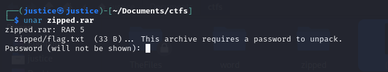
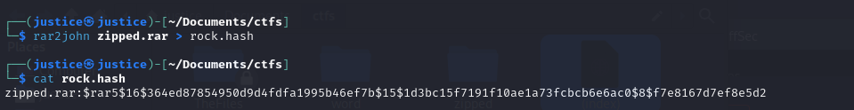
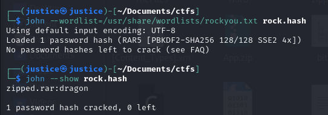
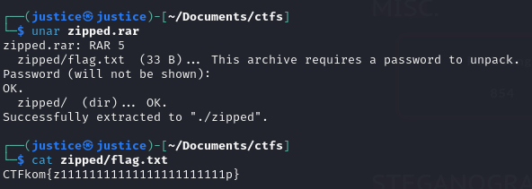

# Title: Rock songs

**Category**: MISC

**Description**: I got sent this zipped folder of rock songs but no password. Can you open it for me?

Flag-format: CTFkom{fake_flag}

----

We are provided with a RAR archive and the first step is to try extracting its contents.

```
unar zipped.rar
```

However, we the RAR file is password protected.




Since the password is required to extract the files, our goal becomes to crack the archive password.

To get the password, we can use ```John the Ripper```, a password cracking tool.

John the Ripper works by attempting many password guesses against a hash. However, the RAR file itself doesn't directly provide a hash in the required format. So we first need to extract the hash from the archive.<br>
For this, we will use ```rar2john```, a helper utility that converts RAR archives into a hash format that John the Ripper can process.

So if we could illustrate the stpes that we are following, it would look something like this: 

```
RAR file --> rar2john --> hash --> John the Ripper --> cracked password
```

We run the following command to extract the password hash from the archive:

```
rar2john zipped.rar > rock.hash
```

This command reads the encrypted metadata inside the archive and writes the corresponding hash to ```rock.hash```.



Next, we run John the Ripper to crack the extracted hash. Since John typically performs dictionary attacks, we need to provide it with a wordlist containing possible passwords to test agains the hash. The title of the challenge is "Rock songs" so that is a hint that suggests we should use the rockyou wordlist.

We can run John with the wordlist using the following command:

```
john --wordlist=/usr/share/wordlists/rockyou.txt rock.hash
```

John will then attempt each password from the wordlist until it finds one that matches the hash.

Normally, John will display the password automatically once it is cracked. However, since the hash is already cracked in my pc, I need to run ```john --show rock.hash``` as well.



Now that we know the cracked password is ```dragon```, we can successfully extract the archive. After extraction, we find a file named ```flag.txt``` which contains the flag for the challenge.




## Flag: CTFkom{z11111111111111111111111p}